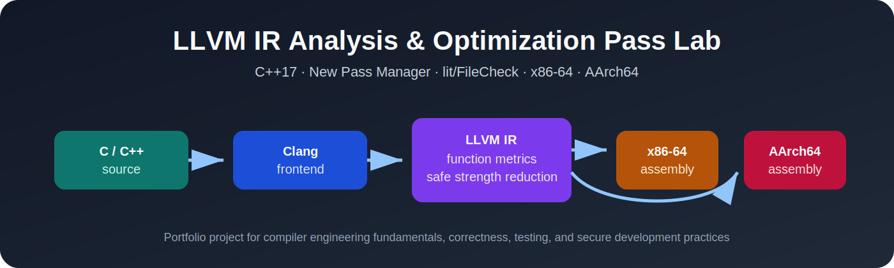
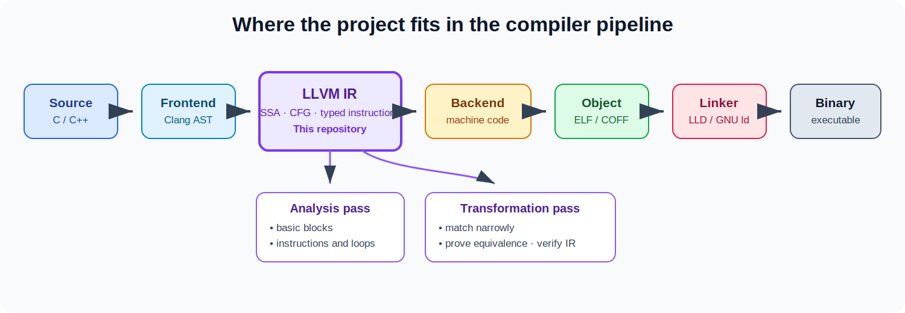
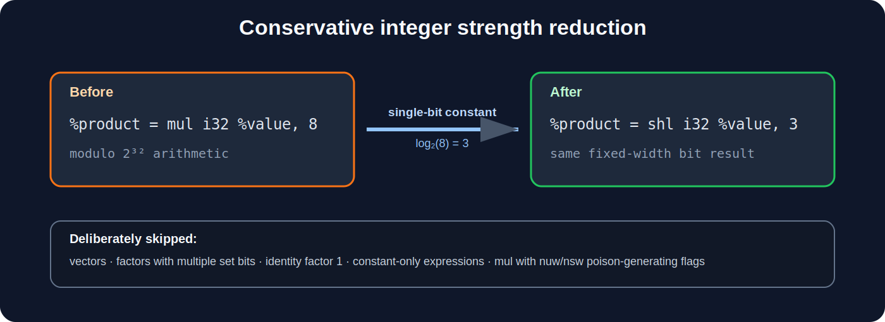
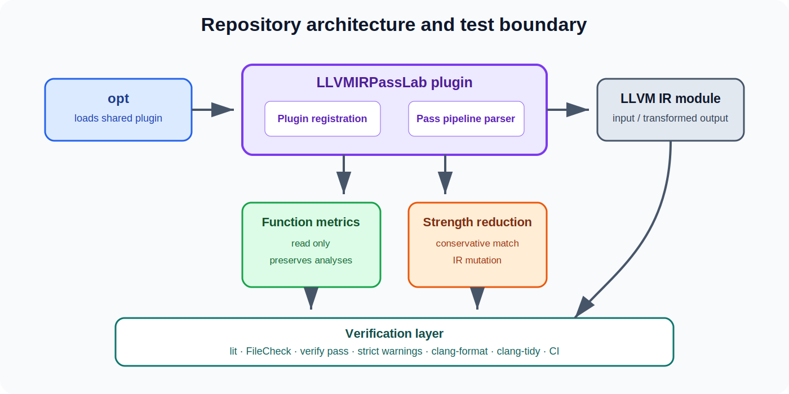
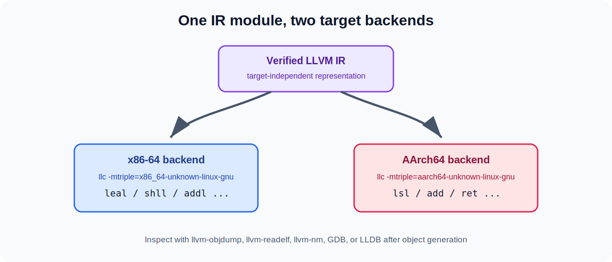

<p align="center">
  
</p>

# LLVM IR Analysis & Optimization Pass Lab

[](https://github.com/sfwoszcz/Project-LLVM-IR-Analysis-Optimization-Passes/actions/workflows/ci.yml)


A portfolio-grade, out-of-tree LLVM pass plugin written in modern C++17.

The project teaches and demonstrates:

- LLVM's new pass manager;
- LLVM IR, SSA, basic blocks, control flow, and loops;
- read-only analysis passes;
- conservative IR transformations;
- pass registration and composition with `opt`;
- regression testing with `lit` and FileCheck;
- IR verification;
- x86-64 and AArch64 code generation;
- strict warnings, formatting, static analysis, Docker, and CI;
- secure coding and defensive transformation design.

The repository intentionally favors **correctness, explainability, and testability** over aggressive optimization.

## Why this project exists

Compiler work is not only about making code faster.

A compiler developer must be able to:

1. understand the source-to-binary pipeline;
2. reason about an intermediate representation;
3. recognize when a transformation is legal;
4. preserve semantics, relevant debug information, and analysis validity;
5. test both positive and negative cases;
6. inspect target-specific assembly;
7. write maintainable C++ that integrates with a large framework.

This repository provides a focused path through those fundamentals.

<p align="center">
  
</p>

## Implemented passes

### `function-metrics`

A read-only function pass that reports deterministic structural metrics:

- basic blocks;
- instructions;
- loads and stores;
- calls;
- branches and returns;
- PHI nodes;
- natural loops.

Example:

```text
[function-metrics] function=@leaf basic_blocks=1 instructions=4 loads=1 stores=0 calls=0 branches=0 returns=1 phi_nodes=0 loops=0
```

Because the pass does not modify IR, it returns:

```cpp
llvm::PreservedAnalyses::all()
```

### `safe-strength-reduction`

A deliberately conservative transformation pass.

It rewrites:

```llvm
%product = mul i32 %value, 8
```

into:

```llvm
%product = shl i32 %value, 3
```

The transformation is limited to cases where:

- the result type is a scalar integer;
- exactly one operand is an integer constant;
- the constant contains exactly one set bit;
- the factor is not one;
- the multiplication has no `nuw` or `nsw` flags;
- the expression is not constant-only.

The pass intentionally skips cases that require additional poison, overflow, vector, or profitability reasoning.

<p align="center">
  
</p>

## Architecture

<p align="center">
  
</p>

The plugin exposes LLVM's dynamic pass-plugin entry point:

```cpp
extern "C" llvm::PassPluginLibraryInfo llvmGetPassPluginInfo();
```

`opt` loads the shared library and asks the plugin to register pipeline names.

The project registers two function passes:

```text
function-metrics
safe-strength-reduction
```

They can be run separately or composed:

```bash
opt \
  -load-pass-plugin build/LLVMIRPassLab.so \
  -passes='safe-strength-reduction,function-metrics,verify' \
  -disable-output \
  input.ll
```

## Repository layout

```text
.
├── .github/workflows/
│   └── ci.yml                         GitHub Actions build, test, demo, and analysis
├── cmake/
│   └── CompilerWarnings.cmake         Strict warning policy
├── docs/
│   ├── images/                        Original SVG diagrams
│   ├── COMPILER_FUNDAMENTALS.md       Source-to-binary foundations
│   ├── DESIGN.md                      Pass architecture and legality reasoning
│   ├── LEARNING_ROADMAP.md            Guided study plan
│   └── SECURE_CODING.md               Defensive coding and threat model
├── examples/
│   ├── c/strength_reduction.c         C source used to generate IR
│   └── ir/handwritten.ll              Small hand-written LLVM IR example
├── include/LLVMPassLab/
│   ├── FunctionMetrics.h
│   ├── Plugin.h
│   └── SafeStrengthReduction.h
├── lib/
│   ├── FunctionMetrics.cpp
│   ├── Plugin.cpp
│   └── SafeStrengthReduction.cpp
├── scripts/
│   ├── bootstrap_ubuntu.sh            Verified apt.llvm.org key installation
│   ├── build.sh
│   ├── check_format.sh
│   ├── compare_targets.sh
│   ├── clean.sh                       Guarded build-directory removal
│   ├── generate_ir.sh
│   ├── run_demo.sh
│   └── test.sh
├── tests/
│   ├── Analysis/
│   ├── Transforms/
│   ├── lit.cfg.py
│   └── lit.site.cfg.py.in
├── CMakeLists.txt
├── Dockerfile
├── Makefile
├── SECURITY.md
└── VERIFICATION.md
```

## Supported toolchains

The code is intended for LLVM 18 through LLVM 22.

The primary build and CI configuration uses LLVM 22.

LLVM 22.1.8 was the latest LLVM 22 maintenance release when this project template was prepared.

The pass API used here is intentionally conventional:

- `llvm::PassInfoMixin`;
- `llvm::FunctionPassManager`;
- `llvm::FunctionAnalysisManager`;
- `llvm::PassBuilder`;
- `llvm::PassPluginLibraryInfo`.

LLVM 23 and later may require small source or CMake updates.

## Prerequisites

A typical Ubuntu installation requires:

- LLVM and Clang development packages;
- `opt`, `llc`, FileCheck, and `llvm-lit`;
- CMake 3.20 or newer;
- Ninja;
- Python 3;
- a C++17 compiler.

For Ubuntu 24.04 or 22.04, the repository includes a bootstrap script that:

- downloads the official apt.llvm.org signing key over HTTPS;
- verifies its full fingerprint;
- installs the key into a dedicated keyring;
- uses a `signed-by` repository restriction;
- installs versioned LLVM packages.

```bash
sudo LLVM_VERSION=22 ./scripts/bootstrap_ubuntu.sh
```

Review installation scripts before running them with elevated privileges.

## Quick start

### CMake and Ninja

```bash
git clone https://github.com/sfwoszcz/Project-LLVM-IR-Analysis-Optimization-Passes.git
cd Project-LLVM-IR-Analysis-Optimization-Passes

cmake \
  -S . \
  -B build \
  -G Ninja \
  -DCMAKE_BUILD_TYPE=Debug \
  -DCMAKE_CXX_COMPILER=clang++-22 \
  -DLLVM_DIR=/usr/lib/llvm-22/lib/cmake/llvm \
  -DLLVM_PASS_LAB_WARNINGS_AS_ERRORS=ON

cmake --build build --parallel
cmake --build build --target check-llvm-pass-lab
ctest --test-dir build --output-on-failure
```

### Make wrapper

```bash
make LLVM_VERSION=22 test
```

### Docker

```bash
docker build \
  --build-arg LLVM_VERSION=22 \
  -t llvm-ir-pass-lab:22 .

docker run --rm llvm-ir-pass-lab:22
```

## First hands-on walkthrough

### 1. Generate LLVM IR from C

```bash
LLVM_VERSION=22 ./scripts/generate_ir.sh
```

Equivalent command:

```bash
clang-22 \
  -S \
  -emit-llvm \
  -O0 \
  -Xclang -disable-O0-optnone \
  examples/c/strength_reduction.c \
  -o build/examples/strength_reduction.ll
```

Why disable `optnone`?

At `-O0`, Clang commonly adds the `optnone` attribute.

Optional optimization passes may be skipped on such functions.

Disabling that attribute makes the generated IR useful for pass experimentation while retaining a mostly unoptimized structure.

### 2. Run the analysis pass

```bash
opt-22 \
  -load-pass-plugin build/LLVMIRPassLab.so \
  -passes='function-metrics' \
  -disable-output \
  build/examples/strength_reduction.ll
```

### 3. Run the transformation pass

```bash
opt-22 \
  -load-pass-plugin build/LLVMIRPassLab.so \
  -passes='safe-strength-reduction,verify' \
  -S \
  build/examples/strength_reduction.ll \
  -o build/examples/strength_reduction.optimized.ll
```

Inspect the relevant instructions:

```bash
grep -nE 'define|mul|shl|ret' \
  build/examples/strength_reduction.optimized.ll
```

### 4. Run the complete demo

```bash
BUILD_DIR="$PWD/build" LLVM_VERSION=22 ./scripts/run_demo.sh
```

## Target-specific code generation

LLVM IR is target independent.

The backend lowers the same verified module into different instruction sets.

<p align="center">
  
</p>

Generate both assembly files:

```bash
BUILD_DIR="$PWD/build" LLVM_VERSION=22 \
  ./scripts/compare_targets.sh
```

The script runs:

```bash
llc-22 \
  -O2 \
  -mtriple=x86_64-unknown-linux-gnu \
  input.ll \
  -o x86_64.s

llc-22 \
  -O2 \
  -mtriple=aarch64-unknown-linux-gnu \
  input.ll \
  -o aarch64.s
```

Useful next tools:

```bash
llvm-as-22 input.ll -o input.bc
llvm-dis-22 input.bc -o roundtrip.ll
llc-22 -filetype=obj input.ll -o input.o
llvm-objdump-22 -d input.o
llvm-readelf-22 --all input.o
llvm-nm-22 input.o
```

## Testing strategy

Every transformation should have at least:

- a positive test proving that the intended rewrite occurs;
- a negative test proving that unsupported inputs remain unchanged;
- a verifier stage proving that the output IR is structurally valid;
- a composition test proving that it works with another pass.

Example test:

```llvm
; RUN: opt -load-pass-plugin %plugin \
; RUN:   -passes='safe-strength-reduction,verify' -S %s | FileCheck %s

define i32 @constant_on_right(i32 %value) {
; CHECK-LABEL: define i32 @constant_on_right(
; CHECK: %product = shl i32 %value, 3
; CHECK-NOT: mul i32
entry:
  %product = mul i32 %value, 8
  ret i32 %product
}
```

Run all LLVM-style tests:

```bash
cmake --build build --target check-llvm-pass-lab
```

Run through CTest:

```bash
ctest --test-dir build --output-on-failure
```

See [VERIFICATION.md](VERIFICATION.md) for the test matrix.

## Correctness reasoning

For an `N`-bit integer bit-vector and a constant `2^K`:

```text
x × 2^K mod 2^N = x << K mod 2^N
```

This makes unflagged fixed-width integer multiplication by a single-bit constant equivalent to a left shift.

The project still applies conservative restrictions.

### Why skip `nuw` and `nsw`?

LLVM wrap flags can make an instruction produce poison when the mathematical result does not fit the promised unsigned or signed range.

A transformation involving poison-generating flags needs an explicit proof that the replacement has exactly the same poison behavior.

Rather than silently making a broad claim, this educational pass skips such instructions.

### Why skip vectors?

The transformation can be generalized to vectors.

However, vector constants, scalable vectors, poison lanes, and target profitability deserve separate tests and explanations.

### Why skip factor one?

`x * 1` is better handled by canonical simplification.

Replacing it with `x << 0` would not improve the IR.

### Why run `verify`?

A pass can create syntactically valid C++ while producing invalid LLVM IR.

The verifier checks structural invariants such as types, dominance, SSA consistency, and instruction constraints.

## Secure coding practices

Compiler plugins process complex input and run inside trusted compiler processes.

That creates several security and reliability concerns.

This project applies the following practices:

- narrow transformation preconditions;
- no unchecked downcasts;
- iterator-safe mutation;
- no manual ownership of LLVM IR nodes;
- no shell `eval`;
- quoted shell expansions;
- strict shell mode;
- validated toolchain-version input and guarded temporary files;
- guarded deletion that refuses paths outside the repository;
- deterministic, fixed-field diagnostic output;
- no network or filesystem access from the plugin;
- strict compiler warnings;
- formatting and static analysis;
- positive and negative tests;
- IR verification after mutations;
- least-privilege GitHub Actions permissions;
- pinned GitHub Action commit;
- explicit apt repository key fingerprint verification.

More detail is available in [docs/SECURE_CODING.md](docs/SECURE_CODING.md).

## Static analysis and formatting

Check formatting:

```bash
LLVM_VERSION=22 ./scripts/check_format.sh
```

Configure clang-tidy during compilation:

```bash
cmake \
  -S . \
  -B build-tidy \
  -G Ninja \
  -DCMAKE_CXX_COMPILER=clang++-22 \
  -DLLVM_DIR=/usr/lib/llvm-22/lib/cmake/llvm \
  -DLLVM_PASS_LAB_ENABLE_CLANG_TIDY=ON
```

Or run it over the compilation database:

```bash
run-clang-tidy-22 \
  -p build \
  -header-filter='^.*/(include|lib)/.*'
```

## Debugging the plugin

Build with debug information:

```bash
cmake \
  -S . \
  -B build-debug \
  -G Ninja \
  -DCMAKE_BUILD_TYPE=Debug \
  -DCMAKE_CXX_COMPILER=clang++-22 \
  -DLLVM_DIR=/usr/lib/llvm-22/lib/cmake/llvm

cmake --build build-debug
```

Start `opt` under GDB:

```bash
gdb --args opt-22 \
  -load-pass-plugin build-debug/LLVMIRPassLab.so \
  -passes='safe-strength-reduction' \
  -S \
  examples/ir/handwritten.ll
```

Useful breakpoints:

```gdb
break llvm_pass_lab::SafeStrengthReductionPass::run
break llvm_pass_lab::FunctionMetricsPass::run
run
```

Inspect the current LLVM value from GDB:

```gdb
call Instruction.dump()
call Function.dump()
```

Those helper calls are intended for development builds.

## Continuous integration

The GitHub Actions workflow:

1. checks out the repository with read-only token permissions;
2. installs LLVM 22 through a fingerprint-verified apt repository;
3. checks formatting;
4. configures with strict warnings as errors;
5. builds the plugin;
6. runs lit/FileCheck tests;
7. runs CTest;
8. runs the demonstration;
9. generates x86-64 and AArch64 assembly;
10. runs clang-tidy.

No repository secrets are required.

## Limitations

This is an educational project, not a replacement for LLVM's mature optimization pipeline.

The strength-reduction transformation intentionally does not include:

- cost-model or target profitability analysis;
- vector support;
- scalable-vector support;
- `nuw` or `nsw` flag preservation;
- multiplication by negative multi-bit constants;
- loop-aware transformations;
- analysis preservation beyond the no-change case;
- automatic insertion into Clang's default optimization pipeline;
- an upstream LLVM patch.

LLVM's existing passes may already perform equivalent or more sophisticated transformations.

The value of this project is the transparent implementation, legality reasoning, testing, debugging, and documentation.

## Suggested learning path

1. Read [docs/COMPILER_FUNDAMENTALS.md](docs/COMPILER_FUNDAMENTALS.md).
2. Generate IR from the C example.
3. Hand-edit `examples/ir/handwritten.ll`.
4. Run `function-metrics`.
5. Read the transformation implementation.
6. Add a new positive and negative test.
7. Compare x86-64 and AArch64 assembly.
8. Debug the pass under GDB.
9. Extend metrics with cyclomatic-complexity inputs.
10. Add a second proven transformation.

A structured roadmap is available in [docs/LEARNING_ROADMAP.md](docs/LEARNING_ROADMAP.md).

## Possible future work

- emit metrics as LLVM remarks;
- preserve selected analyses after instruction-only rewrites;
- add unit tests for helper-level matching logic;
- add Alive2 translation validation examples;
- support vector splat constants;
- add a Clang `-fpass-plugin` example;
- add an optimization-remark demonstration;
- inspect ELF symbols and relocations;
- add compile-time and runtime benchmarks;
- prepare an upstream-style patch.


## Publishing to GitHub

Repository naming, topic suggestions, first-push commands, and recommended
security settings are documented in
[docs/PUBLISHING.md](docs/PUBLISHING.md).


## References

- [Writing an LLVM pass with the new pass manager](https://releases.llvm.org/22.1.0/docs/WritingAnLLVMNewPMPass.html)
- [Using the new pass manager](https://llvm.org/docs/NewPassManager.html)
- [LLVM language reference](https://llvm.org/docs/LangRef.html)
- [LLVM testing infrastructure guide](https://llvm.org/docs/TestingGuide.html)
- [FileCheck documentation](https://llvm.org/docs/CommandGuide/FileCheck.html)
- [LLVM coding standards](https://llvm.org/docs/CodingStandards.html)
- [LLVM command guide](https://llvm.org/docs/CommandGuide/)
- [LLVM releases](https://releases.llvm.org/)
- [LLVM Debian and Ubuntu packages](https://apt.llvm.org/)

## License

MIT.
See [LICENSE](LICENSE).

LLVM is a separate project distributed under the Apache License 2.0 with LLVM exceptions.
This repository is not an official LLVM project.
